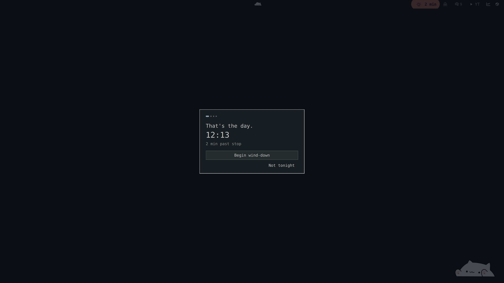
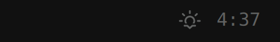
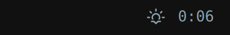
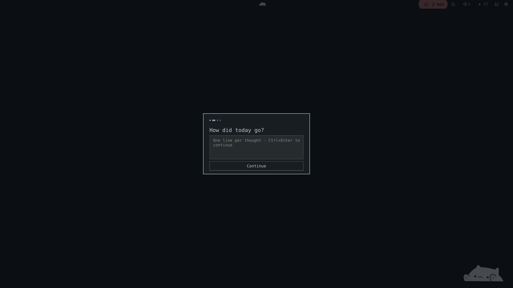
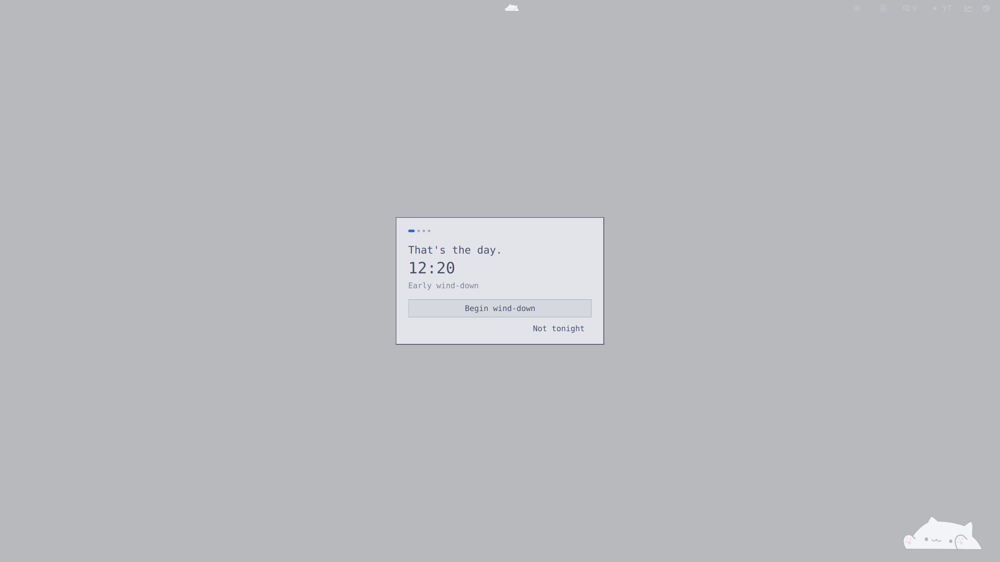
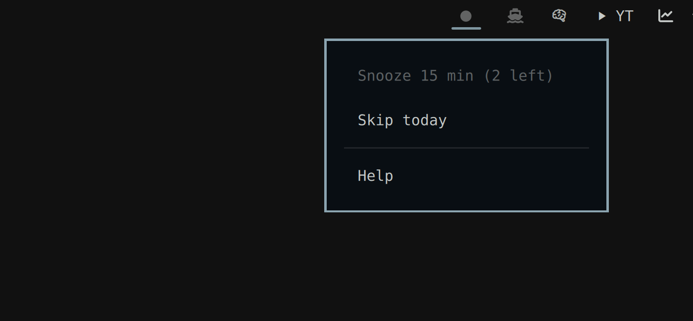

# Hard Stop

A quitting-time boundary for the [Omarchy](https://omarchy.org) bar. Every other timer points into work. This one points out.

Hard Stop counts down to the end of your workday, escalates gently as the boundary approaches, and closes the day with a short wind-down ritual: a five-line recap, tomorrow's first action, done. No lock, no scorecard, no cloud.



## How it works

The chip lives in your bar and escalates as the boundary approaches:

| State | When | Appearance |
|---|---|---|
|  | More than `warnMinutes` out | Sunset glyph + `H:MM` remaining, muted |
|  | Inside `warnMinutes` (default 30) | Accent color, one soft pulse per minute |
|  | Last 5 minutes | Accent pill, bold minutes |

At stop time a desktop notification fires and the wind-down overlay opens. It opens once per day, and once more after each snooze. It is a ritual, not a lock: **Esc always dismisses it**, and a dismissed overlay never reopens on its own.



A 28-second interaction recording lives in [assets/demo.mp4](assets/demo.mp4).

Four cards: *That's the day* → a five-line recap of today → tomorrow's first action → done. The recap and tomorrow line are appended to a plain Markdown file:

```markdown
## 2026-08-21

- Shipped the Hard Stop plugin end to end
- Reviewed both parallel implementations line by line

### Tomorrow

- Publish the repo and announce the plugin
```

## Features

- Per-weekday stop times (default 17:00 Mon-Fri; weekends off)
- Calm → warning → final escalation, then a dismissible wind-down ritual
- Day recap + tomorrow's first action saved to plain Markdown
- Snooze (15 min, bounded), skip-today, early wind-down from the chip
- Right-click menu; every action also scriptable over IPC
- Theme-aware via Omarchy semantic tokens, so it recolors live on theme switch
- Horizontal and vertical bars
- Suspend-safe: state is recomputed from the wall clock every tick, never accumulated
- Zero network access, zero accounts, zero analytics

Every surface is drawn from theme tokens, so a live theme switch recolors the open overlay with no restart. On Catppuccin Latte:



## Installation

```bash
omarchy plugin add https://github.com/joshuaswarren/omarchy-hardstop
omarchy plugin enable io.github.joshuaswarren.hardstop right
```

Zero configuration required: the defaults give you a 17:00 stop Monday through Friday and a recap file at `~/Documents/day-recaps.md`.

## Configuration

Settings live inline on the plugin's entry in `~/.config/omarchy/shell.json`. Both the bar layout entry and the top-level `plugins[]` entry work; the layout entry wins. Edits hot-apply.

```json
{
  "id": "io.github.joshuaswarren.hardstop",
  "schedule": { "mon": "17:00", "tue": "17:00", "wed": "17:00", "thu": "17:00", "fri": "17:00" },
  "warnMinutes": 30,
  "maxSnoozes": 2,
  "recapFile": "~/Documents/day-recaps.md",
  "onCompleteExec": "",
  "quiet": false,
  "showWhenIdle": true
}
```

| Key | Default | Meaning |
|---|---|---|
| `schedule` | 17:00 Mon-Fri | Weekday → `"HH:MM"` stop time. Omit a day for no boundary that day. A day with an unparseable time is treated as off. If nothing in the object parses, the whole schedule falls back to the default. |
| `warnMinutes` | `30` | Minutes before stop when the chip turns accent and a notification fires. Clamped to 1-720. |
| `maxSnoozes` | `2` | Snoozes per day, 15 minutes each. The next one is refused, gently. Clamped to 0-24. |
| `recapFile` | `~/Documents/day-recaps.md` | Plain-text file the ritual appends to. Created if missing. Must be an absolute (or `~/`) path ending in `.md`, `.markdown`, or `.txt`. No `..`, no dotfile names. Anything else is refused with a console warning. |
| `onCompleteExec` | `""` | Optional shell command run once when the ritual completes (e.g. a do-not-disturb toggle). Empty = disabled. |
| `quiet` | `false` | Suppress the two notifications. The overlay still opens. That is the point. |
| `showWhenIdle` | `true` | Show a dimmed glyph on off-days and after the ritual. `false` hides the chip in those states (the past-stop state stays visible until you finish or skip). |

## Interactions

| Input | Action |
|---|---|
| Left click | Open the wind-down overlay early |
| Middle click | Snooze 15 minutes |
| Right click | Menu: snooze, skip today, help |
| Esc (in overlay) | Dismiss from any card |
| Ctrl+Enter / Enter | Advance recap / tomorrow card |



### IPC

Every service action is also scriptable, so you can bind keys in `~/.config/hypr/bindings.lua`:

```bash
omarchy-shell hardstop windDown       # open the wind-down overlay
omarchy-shell hardstop snooze         # same as middle click
omarchy-shell hardstop skip           # skip today
omarchy-shell hardstop status         # full state as JSON
omarchy-shell hardstop.chip menu      # open the chip menu
omarchy-shell hardstop.chip hideMenu  # close it
```

Like all Omarchy shell IPC, these are callable by any process in your session; they expose no authority such a process does not already have.

## Architecture

- **Service** (`Service.qml` + `Model.js`) owns the clock, the state machine (`offday → idle → warning → final → over → done`), snooze counters, per-day latches, and all file writes. Phase is a pure function of the wall clock, recomputed every second. Suspend and resume land in the right state within one tick.
- **Bar widget** (`BarWidget.qml`) is pure presentation of service state.
- **Overlay** (`Overlay.qml`) implements the Omarchy plugin lifecycle: `open(payloadJson)` / `close()`.
- Once-per-day effects (notifications, auto-open) are latched in `${XDG_STATE_HOME:-~/.local/state}/omarchy-hardstop/state.json`, keyed by date, so a shell restart never re-fires the ritual and stale latches self-reset at midnight.

## Security

Files written: exactly two. The plugin appends to the `recapFile` you configure, with the validation the settings table describes. The append rewrites the whole file atomically. It also keeps a latch file at `${XDG_STATE_HOME:-~/.local/state}/omarchy-hardstop/state.json`. A relative `XDG_STATE_HOME` is ignored per the XDG spec. If the recap file exists but cannot be read, the plugin refuses to write rather than risk truncating it, and tells you via notification.

Processes launched: `omarchy-notification-send` with fixed arguments, `mkdir -p` for the two parent directories above, and `xdg-open` on this README's URL from the Help menu item. If you set it, your `onCompleteExec` command runs via `sh -c`. It ships empty. Recap text and other plugin data are never interpolated into it.

Nothing else: no network access, no credentials, no clipboard access, no privileged operations. The only persistent background activity is a one-second wall-clock timer.

One caveat applies to every Omarchy shell plugin, not just this one: plugins run unsandboxed in a single process, so any installed plugin can rewrite `shell.json`, including this plugin's settings. Hard Stop grants such a neighbor nothing it could not already do directly.

## Development

```bash
git clone https://github.com/joshuaswarren/omarchy-hardstop
node tests/run-model-tests.mjs        # pure-logic test suite (103 checks)
omarchy plugin validate .             # manifest + entry-point validation
```

Plugin code under `~/.config/omarchy/plugins/` hot-reloads on save; QML component changes may additionally need `omarchy restart shell` to flush the engine's component cache.

The full behavior spec and acceptance criteria live in [docs/REQUIREMENTS.md](docs/REQUIREMENTS.md).

## License

[MIT](LICENSE)
